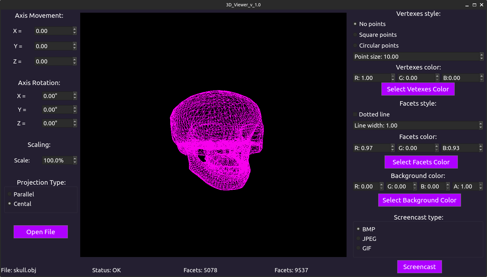

# 3DViewer v1.0 by tomokoki and bruscoaz

## Information:

В данном проекте была разработана программа на языке Си с использованием графической библиотки и модулей Qt, которая предоставляет возможность просматривать модели в каркасном виде.

## Installation:

Для установки необходимо перейти в директорию src и в командной строке написать `make install`. Приложение будет установлено в папку __build__, которая автоматически создается уровнем выше. Для деинсталяции также находясь в дирректории src напишите `make uninstall`.

## Options:

Основы управления:
- Для начала работы необходимо открыть файл при помощи кнопки "Open file". В предложенном диалоговом окне необходимо выбрать файл с расширением .obj;
- На панели Axis Movement при помощи изменения значений компонентов SpinBox можно двигать модель по осям x, y, z;
- Изменение значений в панеле Axis Rotation позволяет вращать модель по выбранной оси на введенное значение в градусах;
- Изменения поля Scale позволит масштабировать модель;
- Для изменения тип проекции нужно выбрать либо Parallel (параллельная), либо Central (центральная);
- Панель Verexes style позволяет настраивать вершины. Вы можете выбрать вид их отображения (нет, квадрат, круг), выбрать их размер, изменив поле Poin Size, а также выбрать цвет - либо введя значения RGB в ручную, либо выбрав цвет из палитры, нажав на кнопку "Select Vertexes Color";
- Панель Facets style неоходима для настройки отображения ребер. Поставив флаг в поле Dotted line, линии станут пунктирными, убрав его - линии снова станут сплошными. Line width позволяет задать толщину линий, также можно настроить цвет линий (аналогично дейстивям, описанным выше);
- Панель Background Color - позволяет либо в ручную вбивать цвет заднего фона, либо через палитру при нажатии на кнопку "Select Background Color";
- В панели Screencast Type вы можете выбрать тип сохраняемого изображения: bmp, jpeg или gif изображение (640x480, 5 секунд, 10 кадров в секунду). Для записи необходимо выбрать нужную модель и нажать кнопку "Screencast";
- На нижней панеле приведена информация по текущей модели: 
    - File: выводит имя файла;
    - Status: выводит информацию о возможных ошибках, либо о том, что все прошло успешно;
    - Vertexes: кол-во вершин у модели;
    - Facets: кол-во ребер у модели;
- Также приложение автоматически сохраняет настройки между сессиями работы с приложением; 

## Examples

Начальный интерфейс:

Открытая модель:

